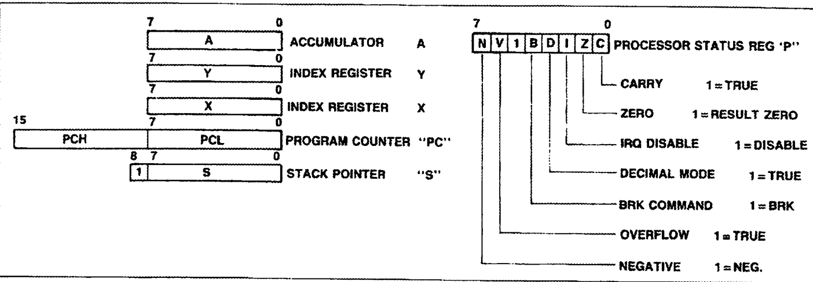
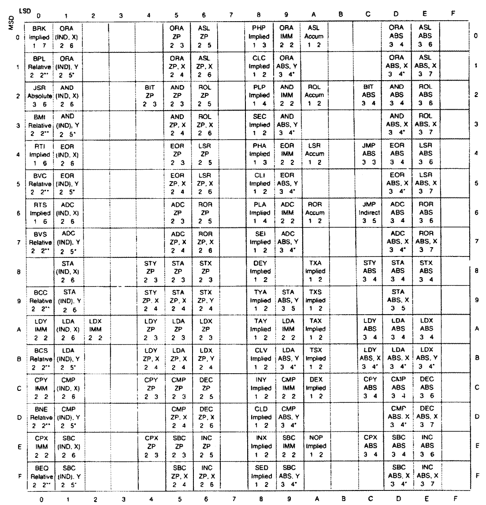

#### 寄存器

6502的寄存器有：

* 1字节 `A` 累加寄存器。
* 1字节 `X`、`Y` 索引寄存器。
* 2字节 `PC` 程序计数器。
* 1字节 `SP` 栈指针寄存器。
* 1字节状态寄存器：
    * `C` 进位标志，第0位。
    * `Z` 零标志，第1位。
    * `I` 中断禁用，第2位。
    * `D` 十进制模式，第3位。
    * `B` 中断，第4位。
    * `V` 溢出标志，第6位。
    * `N` 负标志，第7位。

#### 指令

6502一条指令可以是1~3字节大小，读取一条指令的第一个字节时，根据字节的高四位和低四位，作为索引，从预定义的表中获取对应的指令信息。

如果将表折叠为一维，那么第一个字节就是指令的索引。

#### 寻址模式

absolute：指令第二、三字节表示操作数的地址。

absolute x|y：abs 和寄存器相加得到操作数地址。

accumulator：寄存器 `a` 即为操作数。

immediate：指令第二个字节是操作数。

implied：指令无操作数。

absolute indirect：指令第二、三个字节作为操作数的地址。

indexed indirect x：使用 `x` 作为变址寄存器，和 IND 的结果相加，作为间接地址。

indexed indirect y：将 [IND] 的结果和 `y` 相加，作为操作数地址。

relative：指令第二个字节是相对偏移，`pc` 加上偏移即为操作数地址。偏移的范围为 `-128~127`。

zero page：指令第二个字节是操作数的地址。

zero page x|y：zero page 和 `x` 或 `y` 寄存器进行无进位加法后得到操作数地址。

#### 指令集详解
[指令集详解](https://wusiyu.me/6502-cpu%E6%B1%87%E7%BC%96%E8%AF%AD%E8%A8%80%E6%8C%87%E4%BB%A4%E9%9B%86/)